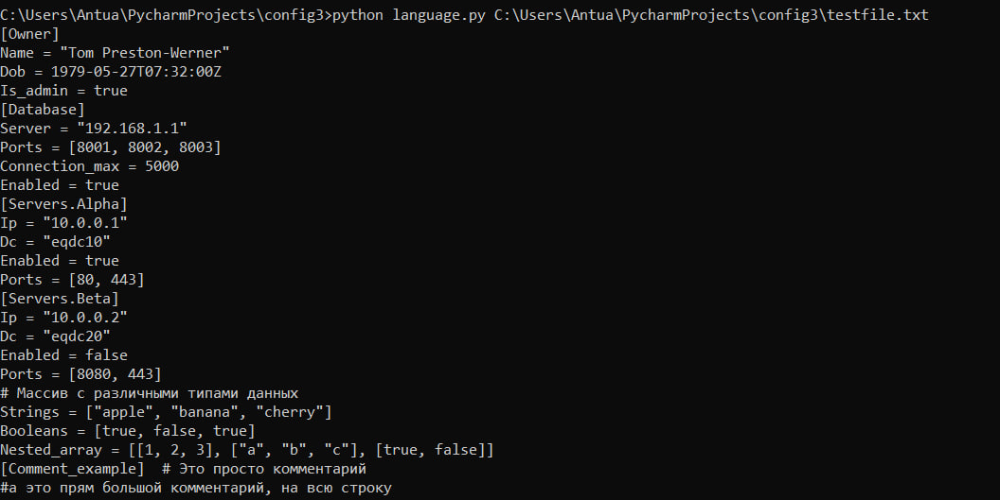

### Общее описание работы
Разработать инструмент командной строки для визуализации графа
зависимостей, включая транзитивные зависимости

### Используемые модули и язык программирования
Использую язык программирования Python версии 3.10
В качестве модулей, импортируемых в программу, использую
1. os - для работы с путями.
2. gzip - для работы над архивом формата gz.
3. subprocess - для взаимодействия с командной строкой
4. sys - для взаимодействия c аргументами из командной строки
5. PIL - для отрисовки изображения
6. subprocess - для запуска командной строки
7. requests - для получения данных с http
8. io - работа с различными типами ввода-вывода

### Описание команд, функционирование программы
Пользователь через консоль вводит два параметра для программы, они обрабатываются и выводится картинка (при корректных данных)
Сам процесс был разделён на 5 этапов.
Пробежимся по каждому:
1. Получение из архива пакетов файла, в котором, в том числе присутствуют искомые зависимости пакетов(функция get_dependencies(url))
2. Парсинг этого файла и создание на его основе структуры, учитывающей вложенные зависимости, в случае Python cловаря (функция detect_dependencies_recur(file_path, name_package)
3. Трансформирование структуры в синтаксис, с которым plantuml сможет работать (функция transform_to_uml_format())
4. Генерация plantuml png картинки (функция render_plantuml_file(uml_text, path_to_uml)
5. Вывод изображения на экран(функция showing_pic(name))

Все функции также обрабатывают случаи, когда аргументы некорректны. Все временно созданные файлы в конце выполнения программы удаляются.
### Тесты
В папке "tests" хранится файл с расширением .py, содержащий в себе модуль тестирования всех функций, которых можно протестировать.

Все они пройдены успешно.
### Url репозитория.
Домашнее задание размещено на гитхабе, ссылка на репозиторий:
https://github.com/Anton-Su/config2
