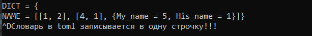
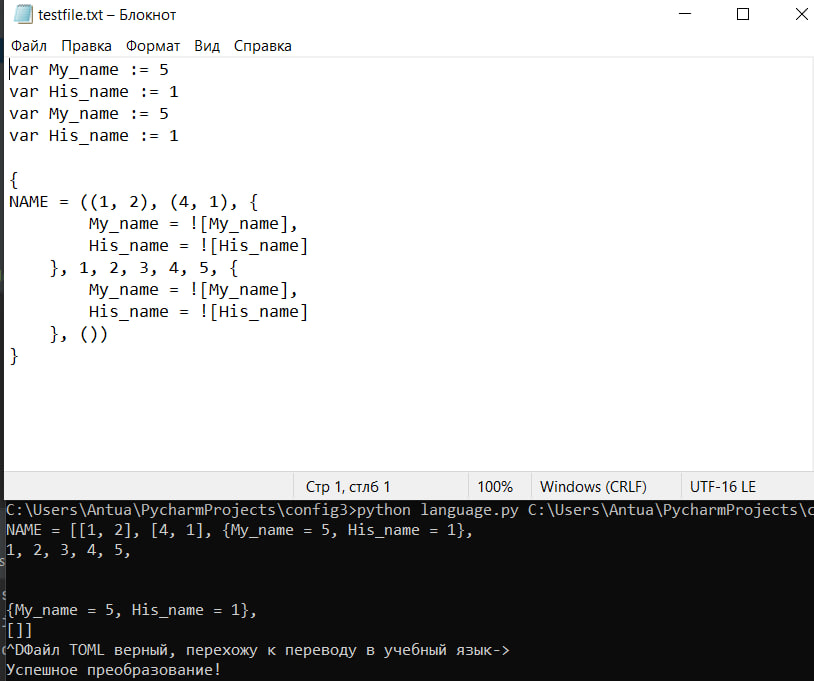
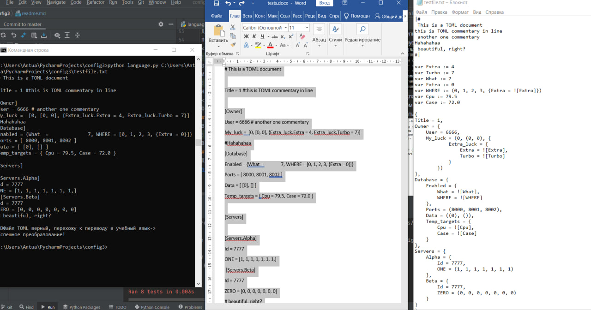
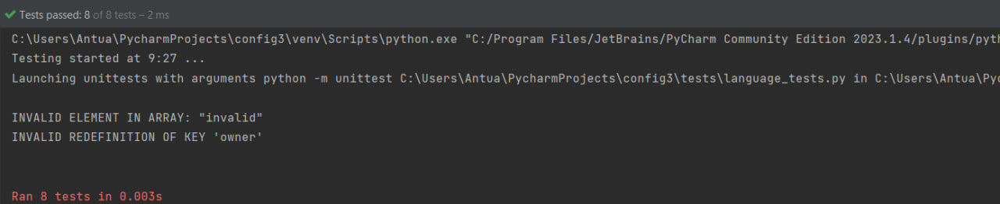

### Общее описание работы
Разработать инструмент командной строки для учебного конфигурационного
языка. Этот инструмент преобразует текст из
входного формата (TOML) в выходной. Синтаксические ошибки выявляются с выдачей
сообщений.

### Используемые модули и язык программирования
Использую язык программирования Python версии 3.10
В качестве модулей, импортируемых в программу, использую
1. os - для работы с путями, проверкой существования файла
2. keyboard - для работы с клавиатурой (учитывания зажатия ctrl+c)
3. threading - для создания многопоточности (создания отдельного потока ввода cимволов до ctrl+c, так как цикл while фризит консоль).
4. time - для создания задержек при получении строк от пользователя, чтобы не перегружать цп.
5. sys - для взаимодействия c аргументами из командной строки и получения строк пользователя во время многопоточности.
6. re - для работы над регулярными выражениями.
7. json (dumps) - для получения красивого вида словаря в формате json

### Описание команд, функционирование программы
Пользователь через консоль вводит параметр для программы (путь текстового файла, в который и будет записан итоговый формат), затем до ввода сочетания ctrl+d вводит данные, которые и будут обрабатываться программой и в конце выводится результат (при некорректных данных (критическая ошибка) соответствующее сообщение об ошибке)
Если корректный TOML файл невозможно конвертировать в учебный язык, будет выдан полный список причин для этого c указанием проблемного места.
Сам процесс выполнения программы был разделён на 3 этапа.
Пробежимся по каждому:
1. Получение строк от пользователя до нажатия сочетания клавиш(функция read_input(text), которая параллельно выполняется c частью main)
2. Парсинг этих данных (функции read_input_after(text) для склеивания строк, parse(value), parse_array(value, dict) и parse_dict(value, dict) для соответствующих разрешённых структур, которые и позволяют создать вложенность)
3. Перевод полученных данных в учебный язык (при успешном вводе пользователя в файл). Иначе пользователь получит сообщение о всех несоответствиях. Под этой задачей подразумевается обработка особенностей учебного языка, а именно:  
(Имена: [_A-Z][_a-zA-Z0-9]*,   а
значения выбираются из диапазона [Числа, Массивы\*, Словари**)

\* ( значение, значение, значение, ... ) 
** { 
 имя = значение, 
 имя = значение, 
 имя = значение, 
 ... 
} 
Объявление же переменной в учебном языке делается вот так:  var имя := значение 
Её же вычисление ![имя] 
Примечание: язык TOML это в своём роде язык таблиц, так как все данные воспринимаются как часть какой-то таблицы, поэтому вполне справедливо, что результат на учебном языке это один большой словарь с поправкой на его синтаксис в учебном языке.
Очевидно, данная программа обрабатывает случаи, когда аргументы некорректны, когда введённые данные не соответствуют TOML.
### Тестирование
Приступим к тестам!  
Итак, пусть пользователь введёт в консоль следующий текст:

Возникла ошибка - "преобразование невозможно", так как на учебном языке значения не могут быть строками, а имена начинаться со строчных букв. 
Исправим указанные ошибки:

Всё действительно так! 
Допустим какую-то ошибку в синтаксисе TOML:

Это действительно так, словари (в двух своих формах) могут быть записано только в одной строчке), в то время как: 
 
Да, увы, этот синтаксис не так уж и прост. Например, нельзя переопределять уже объявленные элементы.  
Протестируем размер данных побольше, воспользуемся первым способом записи таблиц(словарей), точечными ключами, вспомним про комментарии:
 Я решил взять пример с https://toml.io/en/

30 ошибок конвертирования - да, плоховатый пример под нашу задачу я подобрал.
Исправим его, и добавим комментарий в одной линии с текстом:

На изображении представлен ввод данных в середине в консоль (левый угол) и результат в файле (правый угол).
 Результат ровно такой, какой и должен быть!
### Тесты
В папке "tests" хранится файл с расширением .py, содержащий в себе модуль тестирования функций parse(value), parse_array(value, dict), parse_dict(value, dict)

Все они, как видно, из рисунка, пройдены успешно.
### Url репозитория.
Домашнее задание размещено на гитхабе, ссылка на репозиторий:
https://github.com/Anton-Su/config3
